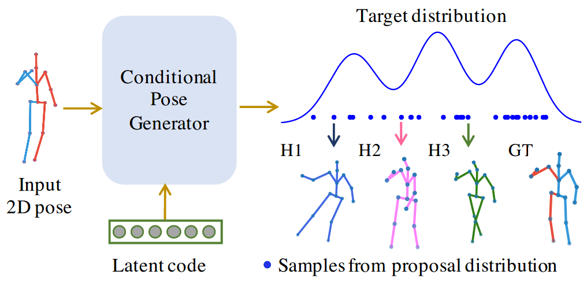
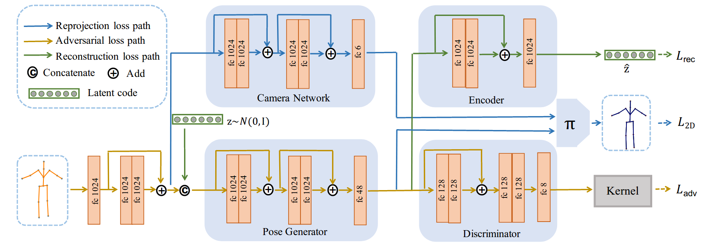

# weakly-supervised-3d-pose-generator

**About**

This is the source code for our paper

Chen Li, Gim Hee Lee. Weakly Supervised Generative Network for Multiple 3D Human Pose Hypotheses. In BMVC2020.

Our deep generative network is conditioned on an input 2D pose. Latent codes are drawn from a normal distribution to generate samples of 3D pose hypotheses that correspond to the target multi-modal posterior distribution.
<p align="center">
  
</p>

Our network consists of four components: (1) a pose generator to generate multiple 3D pose hypotheses from 2D input and latent code; (2) a camera network that estimates the camera matrix to project the generated 3D pose into 2D space; (3) a discriminator as a prior of 3D poses; and (4) an encoder as a second prior to prevent model collapse.

<p align="center">
  
</p>

For more details, please refer to [our paper](https://www.bmvc2020-conference.com/assets/papers/0330.pdf)

**Bibtex**
```
@article{li2020weakly,
  title={Weakly Supervised Generative Network for Multiple 3D Human Pose Hypotheses},
  author={Li, Chen and Lee, Gim Hee},
  journal={BMVC},
  year={2020}
}
```

**Dependencies**
1. Python 3.5.2
2. Tensorflow 1.13.1

**Train**

Get this code:
```
git clone https://github.com/chaneyddtt/weakly-supervised-3d-pose-generator.git
```
Download the [Human3.6 dataset](http://vision.imar.ro/human3.6m/description.php) and preprocess the annotations according to [RepNet](https://openaccess.thecvf.com/content_CVPR_2019/papers/Wandt_RepNet_Weakly_Supervised_Training_of_an_Adversarial_Reprojection_Network_for_CVPR_2019_paper.pdf). Put the data in a new_data folder or you can change the path of data in the code. 

Run:
```
CUDA_VISIBLE_DEVICES=0 python main_mh.py --datatype GT --epochs 50
```
**Test**

Download our [pretrained model](https://drive.google.com/file/d/1gPmNRGyn3l6RrH6X_T6Qm0Fd0-uoZpmb/view?usp=sharing) and [test data](https://drive.google.com/file/d/1U2v_BZJB3GJWF-_rGUPf7njrJyVNNED0/view?usp=sharing), and put in the current folder. 

To test our model trained with the ground truth 2D annotations, run:
```
CUDA_VISIBLE_DEVICES=0 python eval.py --datatype GT --load_path ./models --checkpoint 931070
```
Or you can run :
```
CUDA_VISIBLE_DEVICES=0 python eval.py --datatype SHFT --load_path ./models --checkpoint 971070
```
to test our model trained with 2D detections from the stacked hourglass. The results includes both protocol 1 and protocol 2 under zero code (zc) setting and best hypothesis (bh) setting. Note that the error for the best hypothesis setting may change slightly each time you run the test code because it is based on sampling. The errors for the zero code setting should keep the same.


**Acknowledgements**

The evaluation functions and some loss functions are ported from [@bastianwandt](https://github.com/bastianwandt/RepNet). We also preprocess the data according to the description in the paper [RepNet](https://openaccess.thecvf.com/content_CVPR_2019/papers/Wandt_RepNet_Weakly_Supervised_Training_of_an_Adversarial_Reprojection_Network_for_CVPR_2019_paper.pdf).
